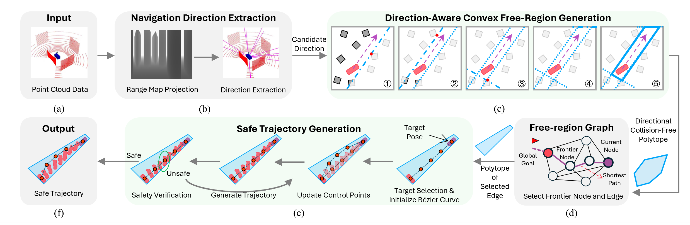
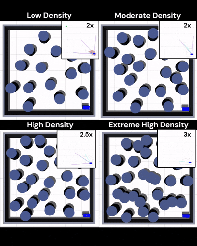
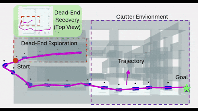

# Safe Navigation in Unknown Cluttered Environments via Direction-Aware Convex Free-Region Generation


## Overview

Convex free regions provide a structured and optimization-friendly representation of collision-free space, but enlarging local free space only according to surrounding obstacle geometry can be insufficient in cluttered environments. In narrow passages, the generated region may fail to both accommodate robot geometry and preserve traversable extension along candidate motion directions. In addition, when robot geometry is modeled explicitly, checking safety only at discretized trajectory samples does not guarantee continuously collision-free motion.

To address these issues, FRGraph jointly incorporates candidate motion directions and robot geometry into convex free-region generation, and achieves continuously collision-free motion through continuous-safe trajectory generation. Within each region, the framework performs geometry-aware target pose selection and trajectory generation, together with Lipschitz-based continuous safety certification and local refinement. The resulting free regions and candidate motions are maintained in a region-based graph to support incremental planning.

<p align="center">
  
</p>

---

## Key Features

- **Direction-aware convex free-region generation**  
  Candidate navigation directions are incorporated into obstacle selection and hyperplane optimization through a direction-biased QP formulation, producing free regions that better preserve traversable space while accommodating robot geometry.

- **Continuous-safe trajectory generation**  
  The framework combines Bézier trajectory parameterization with Lipschitz-based adaptive interval subdivision for continuous safety certification, together with a local QP-based control-point refinement scheme for iterative violation correction.

- **Region-based graph for incremental planning**  
  Generated free regions and candidate motions are organized in a region-based navigation graph, enabling incremental planning and recovery from locally unproductive branches.

---

## Demo

### 2D Navigation in Cluttered Environments

<p align="center">
  
</p>

The proposed framework enables reliable collision-free navigation in cluttered 2D environments across a wide range of obstacle densities.

---

### 3D Navigation with Dead-End Handling

<p align="center">
  
</p>

The maintained region-based graph allows the planner to backtrack from dead-end branches and continue navigation toward the goal.

---

### Real-World Experiments

<p align="center">
  
</p>

The framework transfers effectively to real robots and maintains collision-free navigation in cluttered real-world scenarios.

---

## Results at a Glance

- Quantitative 2D experiments show that the proposed method generates free regions better aligned with downstream traversal and enables reliable collision-free navigation.
- Additional 3D experiments demonstrate dead-end handling and backtracking enabled by the maintained region-based graph.
- Real-world experiments validate the practical applicability of the framework in both 2D and 3D cluttered environments.

<!-- <p align="center">
  
</p> -->

---

## Installation

This project is built in a ROS catkin workspace.

### Dependencies

Before building FRGraph, please make sure the following dependency is available:

- [`catkin_simple`](https://github.com/catkin/catkin_simple)

In addition, the `DecompROS` module used in this project is adapted from the original implementation:

- [`DecompROS`](https://github.com/sikang/DecompROS.git)

### Build Instructions

1. Clone this repository into your catkin workspace:

```bash
cd ~/catkin_ws/src
git clone <your_repo_url>
```

2. Clone `catkin_simple` into the `third_party` directory:

```bash
cd FRGraph/third_party
git clone https://github.com/catkin/catkin_simple.git
```

3. Go back to the workspace root and build the `decomp_*` packages first:

```bash
cd ~/catkin_ws
catkin build decomp_*
```

4. Build the whole workspace:

```bash
catkin build
```

If all steps finish successfully, FRGraph is ready to use.

---

### Quick Start (2D Example)

```bash
roslaunch simple_robot simple_robot.launch if_3d_Lidar:=0
roslaunch planner_manager planner.launch
```

---

## Usage

FRGraph consists of two main components:

- A robot interface (simulation or real robot)
- The planner (`planner_manager`)

### 1. Launch the Robot

You can launch the provided example robot:

```bash
roslaunch simple_robot simple_robot.launch if_3d_Lidar:=0
```

This launch file provides a simple robot setup and can be replaced with your own robot system.

---

### 2. Launch the Planner

```bash
roslaunch planner_manager planner.launch
```

---

## Running in 2D vs 3D Environments

### 2D Mode

To run in a 2D environment:

1. Launch the robot with 2D LiDAR:

```bash
roslaunch simple_robot simple_robot.launch if_3d_Lidar:=0
```

2. Set the environment type in:

```bash
src/planner_manager/config/config.yaml
```

```yaml
env_type: 0
```

3. Set robot geometry:

- Modify the robot vertex coordinates in the configuration file according to your robot shape.

4. Required topics:

- Point cloud (2D LiDAR):  
  `/scan`
- Odometry:  
  `/odom`

---

### 3D Mode

To run in a 3D environment:

1. Launch the robot with 3D LiDAR:

```bash
roslaunch simple_robot simple_robot.launch if_3d_Lidar:=1
```

2. Set the environment type:

```yaml
env_type: 1
```

3. Set robot geometry:

- Update the robot vertex coordinates to match your robot model.

4. Required topics:

- Point cloud (3D LiDAR):  
  `/velodyne_points`
- Odometry:  
  `/odom`

---

## Gap Extraction Parameters

The navigation direction extraction module converts the local LiDAR observation into a range-map representation and extracts candidate direction hypotheses from detected gap regions. These candidate directions are not final traversability certificates. Robot-size and orientation feasibility are handled later by direction-aware free-region generation, target-pose selection, and continuous safety verification.

The main gap-extraction parameters are configured in:

```bash
src/planner_manager/config/config.yaml
```

Representative values used in our experiments are summarized below.

| Item | 2D setting | 3D setting |
|---|---:|---:|
| Range-map representation | Single-row angular range map | Spherical range map over azimuth and elevation |
| Range-map size | `1600 x 1` | `1600 x 32` |
| Horizontal field of view | `[-pi, pi]` | `[-pi, pi]` |
| Vertical field of view | Single elevation row | `[-30.67 deg, 30.67 deg]` |
| Local point-cloud range | `3 m` | `3 m` |
| Open-gap minimum region size | `10` pixels | `20` pixels |
| Limited-gap minimum region size | `2` pixels | `48` pixels |
| Open-gap subregion span | `45 deg` in yaw | `45 deg` in yaw, `30 deg` in elevation |
| Limited-gap subregion span | `30 deg` in yaw | `30 deg` in yaw, `30 deg` in elevation |
| Minimum open-gap subregion size | `20` pixels | `40` pixels |
| Minimum limited-gap subregion size | `2` pixels | `32` pixels |
| Limited-gap splitting threshold | `30 deg` in yaw | `30 deg` in yaw, `30 deg` in elevation |
| Limited-gap direction bias | `10 deg` in yaw/elevation | `10 deg` in yaw/elevation |
| Number of candidate directions | Not fixed a priori; determined by detected gap subregions | Not fixed a priori; determined by detected gap subregions |
| Robot-size filtering | Not performed in gap extraction; handled later by robot-geometry-aware region generation and safety verification | Same |

Depth discontinuities are detected by comparing adjacent range-map cells using an adaptive range threshold of the form:

```text
a + b * r_near * sin(dpsi)
```

together with a geometric occlusion check. The edge-detection parameters used in our experiments are:

| Parameter group | Values |
|---|---|
| Horizontal edge detection | `a_h = 0.20`, `b_h = 0.02`, `lambda_h = 0.5` |
| Vertical edge detection | `a_v = 0.30`, `b_v = 0.05`, `lambda_v = 0.5` |

---

## Input Requirements

The planner requires the following inputs:

- **Sensor data (single-frame point cloud)**
  - 2D mode: `/scan`
  - 3D mode: `/velodyne_points`

- **Robot state (odometry)**
  - `/odom`

Make sure these topics are correctly published before launching the planner.

---

## Notes

- The provided `simple_robot` is only for demonstration. You can replace it with your own robot as long as the required topics are provided.
- The robot geometry (vertex representation) must be consistent with your actual robot to ensure correct collision checking.
- Ensure that the topic names match or are properly remapped if different in your system.

---

## Citation

If you find this project useful, please consider citing our paper:

**Continuous-Safe Navigation in Unknown Cluttered Environments via Direction-Aware Convex Free-Region Generation**

```bibtex
@article{song2026safe,
  title={Safe Navigation in Unknown and Cluttered Environments via Direction-Aware Convex Free-Region Generation},
  author={Song, Zhicheng and Li, Yongjian and Chen, Kai and Li, Yulin and Shi, Fan and Ma, Jun},
  journal={arXiv preprint arXiv:2604.23648},
  year={2026}
}
``` 
An additional related paper is available here:
```bibtex
@ARTICLE{10897898,
  author={Li, Yulin and Song, Zhicheng and Zheng, Chunxin and Bi, Zhihai and Chen, Kai and Wang, Michael Yu and Ma, Jun},
  journal={IEEE Robotics and Automation Letters}, 
  title={FRTree Planner: Robot Navigation in Cluttered and Unknown Environments With Tree of Free Regions}, 
  year={2025},
  volume={10},
  number={4},
  pages={3811-3818},
  keywords={Navigation;Robots;Collision avoidance;Robot sensing systems;Geometry;Trajectory optimization;Data mining;Feature extraction;Real-time systems;Space exploration;Mobile robot navigation;collision avoidance;trajectory optimization},
  doi={10.1109/LRA.2025.3544519}}

```
---

## Acknowledgment

This project builds upon the open-source project [DecompROS](https://github.com/sikang/DecompROS), which provides the foundation for convex decomposition and free-region generation.  
We thank the authors for making their implementation publicly available.

The `DecompROS` module in this repository has been adapted and modified to fit our framework.

---

<!-- ## License

This project is released under the license specified in the `LICENSE` file. -->
